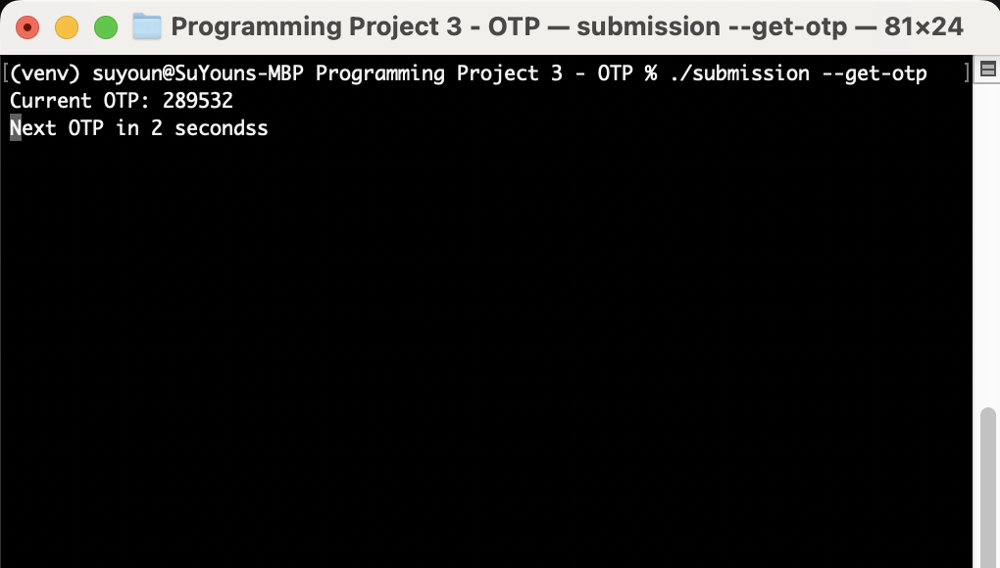

# OTP Generator

## Description
This project is a application that generates and retrieves one-time passwords (OTPs) using the TOTP (Time-based One-Time Password) algorithm. It includes functionality to generate a QR code for setting up the OTP in an authenticator app and to continuously display the current OTP.

## Implementation
The implementation consists of the following components:
- **`main.py`**: The main script that contains two main functionalities:
  - `generate_qr()`: Generates a QR code for the OTP and saves it as `otp_qr.jpg`. The corresponding secret is saved in `secret.txt`.
  - `get_otp()`: Continuously displays the current OTP in 30-second intervals.
- **`Makefile`**: Automates the build and run processes for the application.

## Requirements
- Python3
- `pyotp` library
- `qrcode` library

You can install the required libraries using:
```sh
pip3 install pyotp qrcode
```

## Usage
1. The Makefile includes targets to simplify running the commands. In your terminal, type:
    ```
    make
    ```

2. To generate a QR code for setting up the OTP in an authenticator app, run:
    ```
    ./submission --generate-qr
    ```

3. To display the current OTP, run:
    ```
    ./submission --get-otp
    ```

## Using a Virtual Environment
If you see the "error: externally-managed-environment" error, highly recommend to use a virtual environment. 
1. Create a virtual environment using the following command:
    ```
    python3 -m venv venv
    ```

2. Activate the virtual environment:
    ```
    source venv/bin/activate (on macOS)

    venv\Scripts\activate (on Windows)
    ```

3. Install the required libraries:
    ```
    pip install pyotp qrcode
    ```

4. Follow the steps in the [Usage](#usage) section.

5. If you want to deactivate the virtual environment, run:
    ```
    deactivate
    ```

## Example Output
- **QR Code:**

    

- **Terminal Output:**

    


